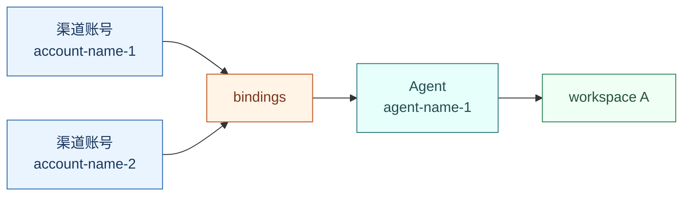
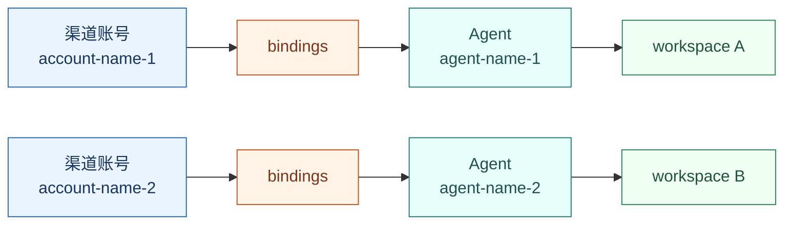

# OpenClaw 多 Agent、多账户到底怎么配？一篇讲清

> 发现群中有很多同学询问如何配置多 Agent，本文将一篇讲清如何配置多 Agent、多账户
>
> 先讲一些 OpenClaw 的多Agent、多账户配置概念，文章最后有完整样例。

很多人在开始做 OpenClaw 多机器人接入时，都会遇到同一类问题：

- 我明明配了两个机器人，为什么它们还像共用一个脑子？
- 我已经配了多账户，为什么记忆、人格、workspace 还是混在一起？
- `dmScope`、`bindings`、`agents.list`、`accounts` 到底谁管谁？

这些问题的根源，是没有先分清 “会话隔离” 和 “机器人隔离” 是两回事。

## 一句话先说结论

只记住一句话，那就是：

> 多账户不等于多 Agent，`dmScope` 也不等于 Agent 隔离。

更准确一点说：

- `channels.<channel>.accounts` 决定这个渠道挂了几个账号
- `agents.list` 决定系统里有几个真正独立的 Agent
- `bindings` 决定某个账号或会话最终进哪个 Agent
- `session.dmScope` 只决定私聊历史怎么分桶，避免串会话

很多“明明配了多个机器人却还是串线”的问题，基本都能归结到这里。


先看效果：

> ClawMate: 为 OpenClaw 添加有温度的角色伴侣。https://github.com/BytePioneer-AI/clawmate
>
> OpenClaw China:面向中国 IM 平台的 OpenClaw 扩展插件集合。https://github.com/BytePioneer-AI/openclaw-china


## 先把四个核心概念和配置职责讲明白

### 1. Agent 是“脑”

在 OpenClaw 里，一个 `agent` 不是一个简单标签，而是一套完整隔离的运行单元，通常意味着：

- 独立 workspace
- 独立 session store

所以，不同 `agentId` 本质上就是不同人格、不同记忆、不同工作区。

对应配置是 `agents.list`，它回答的是：**系统里到底有几个真正独立的 Agent。**

如果你希望两个机器人有各自的 workspace、记忆，就不能只配多账户，必须把多个 Agent 定义出来。

### 2. accountId 是“入口账号”

`accountId` 是某个渠道里的账号实例。

下面用企业微信自建应用 `wecom-app` 举例，其他支持多账号的渠道同理：

- 一个企业微信自建应用接入实例，就是一个 `accountId`
- 如果你有两个机器人账号，就可以叫 `account-name-1` 和 `account-name-2`

这代表的是“有几个入口”，不代表“背后有几个脑”。

对应配置是 `channels.<channel>.accounts`，它回答的是：**某个渠道下到底挂了几个账号。**

例如某个渠道里同时挂两个企业微信自建应用账号，本质就是在这里配置多个 `accountId`。这里仍以 `wecom-app` 场景为例。

### 3. binding 是“路由规则”

`binding` 的作用，是把入站消息分发给某个 `agentId`。

它解决的不是“有没有多个账号”，而是：

- 哪个账号来的消息，交给哪个 Agent
- 哪类会话，应该进入哪个 Agent

如果说 `accountId` 是入口，那 `binding` 就是分流器。

对应配置是 `bindings`，它回答的是：**哪个账号进哪个 Agent。**

这是“一个账户对应一个 Agent”能否成立的关键配置。

### 4. dmScope 是“私聊分桶规则”

`session.dmScope` 只决定私聊会话如何分桶。

| 参数 | 含义 | 适用场景 |
| --- | --- | --- |
| `main` | 所有私聊共用主会话 | 单用户、强调跨渠道连续性 |
| `per-peer` | 按发送者 ID 隔离私聊 | 想按用户区分，但不特别关心渠道差异 |
| `per-channel-peer` | 按渠道 + 发送者隔离私聊 | 多用户收件箱 |
| `per-account-channel-peer` | 按账号 + 渠道 + 发送者隔离私聊 | 多账号收件箱、多机器人场景 |

它解决的是：

- 私聊历史会不会串
- 不同账号、不同用户的私聊会不会落到同一个 session key

但它不决定消息最终进入哪个 Agent，也不决定机器人是否独立。

更准确一点说，消息会先经过 `bindings` 路由进某个 Agent。

下面两张图只画这层最关键的路由关系，不展示 `dmScope`。

再对照看两个场景：

**场景 A：多账户，共用一个 Agent**



**场景 B：多账户，多 Agent**



## 实战里最常见的两种模式

理解了上面四层，再看配置就会简单很多。现实中最常见的，其实只有两种模式。

### 模式 A：多账户，共用一个 Agent

这种模式适合：

- 多个机器人只是多个入口
- 你希望它们共享同一套人格、知识、记忆
- 你只想避免私聊串会话

这时配置重点通常只有两个：

- `channels.<channel>.accounts`
- `session.dmScope: "per-account-channel-peer"`

这种模式的特点是：

- 账号是分开的
- 私聊历史通常也是分开的
- 但背后仍可能是同一个 Agent

换句话说，这是一种“多入口，共用一个脑”的模式。

### 模式 B（推荐）：多账户，多 Agent 完全隔离

这种模式适合：

- 一个机器人就是一个独立角色
- 不同机器人要有独立 workspace
- 不同机器人要有独立记忆和认证信息
- 你希望 **“一个账户对应一个 Agent”**

这时你至少要同时配置：

- `agents.list`
- `channels.<channel>.accounts`
- `bindings.match.accountId`
- `session.dmScope: "per-account-channel-peer"`

这是一种“多入口，对应多个脑”的模式。

也是大多数人真正想实现、但最容易少配一步的模式。

## 一个最实用的判断方法

如果你还不确定自己该选哪种模式，可以用下面这个判断法：

- 如果多个机器人应该共享记忆、共享人格，选“多账户，共用一个 Agent”
- 如果多个机器人应该独立工作、独立记忆、独立认证，选“多账户，多 Agent 完全隔离”

判断标准不要看“有几个账号”，而要看“背后是否需要多个独立脑”。

## 一份可以直接抄的多账号模板（以企业微信自建应用 `wecom-app` 为例）

下面这份示例统一使用 Linux 风格路径，例如 `~/.openclaw/workspace`。

如果你在 Windows 上，对应路径通常会类似：

- `C:\Users\Administrator\.openclaw\workspace`
- `C:\Users\Administrator\.openclaw\workspace-agent-name-1`

下面这份配置，用企业微信自建应用 `wecom-app` 演示“多账号 + 多 Agent 独立机器人”应该怎么写。你如果使用其他渠道，可以照着这个结构替换 `channel` 名和对应的凭证字段。

> 其中 list.id、bindings.agentId、workspace 的名称可以修改

```json
{
  "agents": {
    "defaults": {
      "workspace": "~/.openclaw/workspace"
    },
// 定义 Agent
    "list": [
      {
        "id": "agent-name-1",
        "default": true,
        "workspace": "~/.openclaw/workspace-agent-name-1"
      },
      {
        "id": "agent-name-2",
        "workspace": "~/.openclaw/workspace-agent-name-2"
      }
    ]
  },
 // 会话隔离配置，就按照这个来
  "session": {
    "dmScope": "per-account-channel-peer"
  },
 // 会话路由配置，绑定agent和账号
  "bindings": [
    {
      "agentId": "agent-name-1",
      "match": {
        "channel": "wecom-app",
        "accountId": "account-name-1"
      }
    },
    {
      "agentId": "agent-name-2",
      "match": {
        "channel": "wecom-app",
        "accountId": "account-name-2"
      }
    }
  ],
  "channels": {
    "wecom-app": {
     // 默认账号
      "defaultAccount": "account-name-1",
     // 添加多个账号的权限信息
      "accounts": {
        "account-name-1": {
          "enabled": true,
          "webhookPath": "/wecom-app",
          "token": "your-account-1-token",
          "encodingAESKey": "your-account-1-encoding-aes-key",
          "corpId": "your-corp-id",
          "corpSecret": "your-account-1-corp-secret",
          "agentId": 1000002
        },
        "account-name-2": {
          "enabled": true,
          "webhookPath": "/wecom-app-bot2",
          "token": "your-account-2-token",
          "encodingAESKey": "your-account-2-encoding-aes-key",
          "corpId": "your-corp-id",
          "corpSecret": "your-account-2-corp-secret",
          "agentId": 1000004
        }
      }
    }
  }
}
```

只需要重点看懂三件事：

- `accounts` 里定义了两个渠道账号：`account-name-1` 和 `account-name-2`
- `agents.list` 里定义了两个独立 Agent：`agent-name-1` 和 `agent-name-2`
- `bindings` 把 `account-name-1` 路由到 `agent-name-1`，把 `account-name-2` 路由到 `agent-name-2`

> 注意：显式写 `defaultAccount`
>
> 多账号场景里，建议总是显式配置：
>
> ```
> {
>   "channels": {
>     "wecom-app": {
>       "defaultAccount": "account-name-1"
>     }
>   }
> }
> ```


### 最后-快捷获取配置

给你的龙虾或其他AI编程工具说：

```
请读取并严格执行这个提示词：
https://raw.githubusercontent.com/BytePioneer-AI/openclaw-multi-bot-config/main/doc/openclaw-config-generator-prompt.md

下面是账号信息：
<把 channels.<channel>.accounts 粘贴到这里>
比如：
 "dingtalk": 
      "defaultAccount": "bot1",
      "accounts": {
        "bot1": {
          "clientId": "xxx",
          "clientSecret": "xxx"
        },
        "bot2": {
          "clientId": "xxx",
          "clientSecret": "xxx"
        }
      }
    }
```

或者直接使用这份提示词：

```
请先阅读这篇文档，并严格按文档里的规则生成 OpenClaw 配置：
https://raw.githubusercontent.com/BytePioneer-AI/openclaw-multi-bot-config/main/doc/openclaw-multi-agent-multi-bot-config.md

任务目标：
我要的是“多账户、多 Agent 完全隔离”模式，不是 shared-agent。
请根据我下面提供的账号信息，生成一个完整的 OpenClaw 配置片段，只包含这 4 个顶级块：

- agents
- session
- bindings
- channels

生成要求：
1. 每个 accountId 对应一个独立 agent。
2. 必须显式生成 agents.list。
3. 必须显式生成 bindings，并使用 bindings.match.channel + bindings.match.accountId 做路由。
4. session.dmScope 固定使用 "per-account-channel-peer"。
5. channels 下保留我提供的真实渠道字段名，不要擅自改字段名，不要发明不存在的字段。
6. 必须显式写 defaultAccount。
7. workspace 使用 Linux 风格路径，格式为：
   ~/.openclaw/workspace-<agent-id>
8. OpenClaw 的 agentId 请使用字符串，不要复用渠道账号里的业务字段作为 OpenClaw agentId，除非我明确要求。
9. 如果渠道账号对象里本身有一个名为 agentId 的字段，请把它当作渠道自己的配置字段，不要和 OpenClaw 的 bindings[].agentId 混淆。
10. 输出必须是一个完整 JSON 代码块，不要输出解释文字，不要输出 markdown 列表，不要省略字段。
11. 如果我给出的字段已经足够，请直接生成；只有在字段明显缺失、无法生成合法配置时，才先提问。

补充约束：
- 不要生成 providers、models、plugins、gateway、tools 等无关配置。
- 不要生成 peer 级复杂 bindings。
- 不要把 dmScope 当成 Agent 隔离手段。
- 不要省略 channels.<channel>.accounts。
- 默认按“一个账户对应一个 Agent”处理。

下面是账号信息：
<把你的 channels.<channel>.accounts 信息粘贴到这里>比如：
 "dingtalk": 
      "defaultAccount": "bot1",
      "accounts": {
        "bot1": {
          "clientId": "xxx",
          "clientSecret": "xxx"
        },
        "bot2": {
          "clientId": "xxx",
          "clientSecret": "xxx"
        }
      }
    },

```


